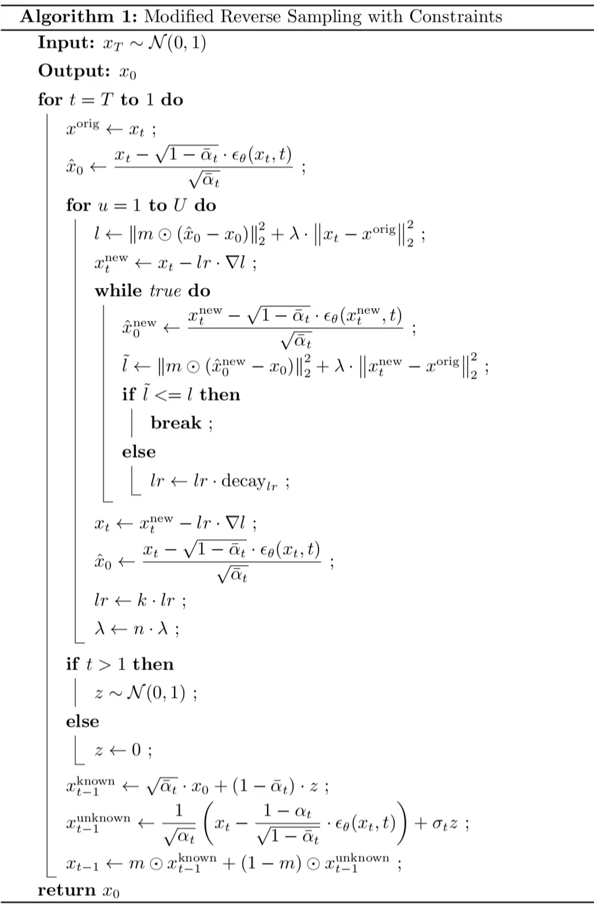

Hi everyone, I'm trying to improve the code in the RePaint repository.
I created this repository to back up some of my own modifications.

I refer to the code in repository [RePaint](https://github.com/andreas128/RePaint) and the code in the [guided-diffuion](https://github.com/openai/guided-diffusion) repository that RePaint is based on.

大家好，我正在努力改进RePaint的代码。我创建这个存储库是为了备份我自己的一些修改。

我参考了[RePaint](https://github.com/andreas128/RePaint)仓库中的代码 和 RePaint基于的[guided-diffuion](https://github.com/openai/guided-diffusion)仓库中的代码。

## 提交记录
```
commit 1 : 重新添加了ddim采样
commit 2 : 把scheduler.py好好整理了一下, 同时.yml中schedule_jump_params不再需要n_sample
commit 3 : ddpm的p_sample()添加了"预测噪声"版本的采样,详情见 issue 1 
commit 4 : 为方便阅读删去了之前注释掉的代码；从《ILVR》搞过来一点东西,详情见 issue 2；
commit 5 : 去掉了commit_4的ILVR; 修改main.py使得 一张gt可得到某张mask的 n_iter张 采样结果; 详情见 issue 3  
commit 6 : 大改动！(1)使用了我的算法,重写了采样的逻辑,下面有相关流程图 (2)恢复部分代码为guided-diffuion仓库版本

```


### commit 6 的采样算法
```bash
python main.py --config_file configs/celebahq.yaml --algorithm o_ddim --dataset_name custom 
```
 




---
A very laid-back update!

随缘更新!
